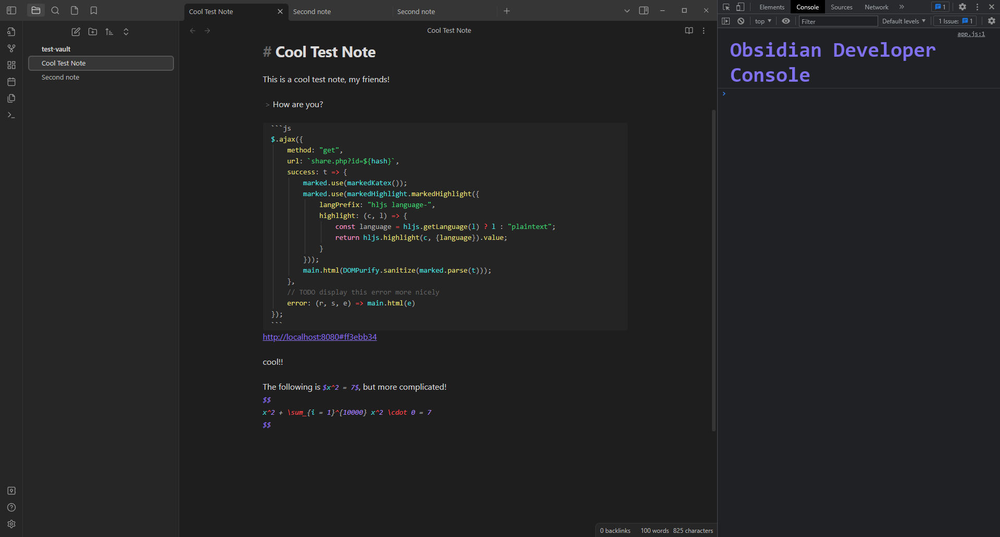

yo
# Cool Test Note

This is a cool test note, my friends!

> How are you?

```js
$.ajax({  
    method: "get",  
    url: `share.php?id=${hash}`,  
    success: t => {  
        marked.use(markedKatex());  
        marked.use(markedHighlight.markedHighlight({  
            langPrefix: "hljs language-",  
            highlight: (c, l) => {  
                const language = hljs.getLanguage(l) ? l : "plaintext";  
                return hljs.highlight(c, {language}).value;  
            }  
        }));  
        main.html(DOMPurify.sanitize(marked.parse(t)));  
    },  
    // TODO display this error more nicely  
    error: (r, s, e) => main.html(e)  
});
```
http://localhost:8080#ff3ebb34

cool!!

The following is $x^2 = 7$, but more complicated!
$$
x^2 + \sum_{i = 1}^{10000} x^2 \cdot 0 = 7
$$

## Some images

image!



wikilink image!

![[Pasted image 20230816130420.png]]

nice